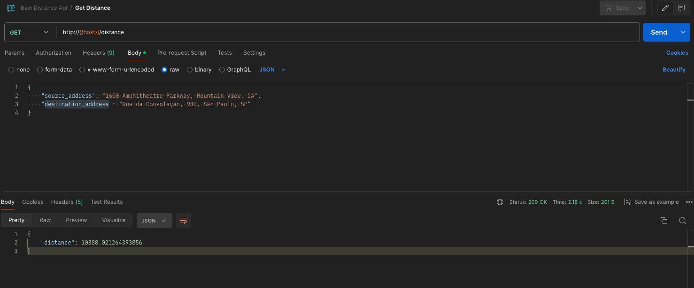
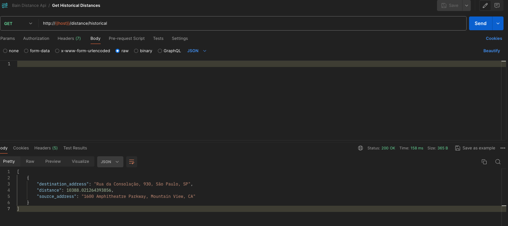

# Bain Distance

A Bain & Company challenge to calculate the distance between two given addresses.

## 1. Stories
1. `story 1`: As an user, I want to get the distance in kilometers between two given addresses.
   1. Acceptance criteria 1: given `source_address` and `destination_address`, return the `distance` in kilometers.
   2. Acceptance criteria 2: when the app fails to calculate this distance for some reason, it should display an error message.


2. `story 2`: As an user, I want to get all the historical queries.
   1. Acceptance criteria 1: return all the historical queries in a list.

## 2. Solution
It was developed an api with two endpoints. One to calculate and get the distance between the given address and other to get the histoical data.

Since the amount of time provided for developing the whole challenge was 5h, the only interface to interact with the application now is a Rest Api. But future implementations can be done, like developing a mobile or web interface.

### 2.1. External services used:
- MongoDB on Atlas(https://www.mongodb.com/products/platform/atlas-database): To store the historical data of the queries.
- Nominatim API (https://nominatim.org/release-docs/develop/api/Overview/): To get the coordinates of the given addresses.
- Harversine Lib (https://pypi.org/project/haversine/): To calculate the distance between the coordinates.
- Heroku (https://www.heroku.com/): To deploy the app.

## 3. API
The documentation of the API can be found in [docs/api.md](docs/api.md)

### 3.1. Clean Architecture
The project was developed following the principles of Clean Architecture, where the application is divided into layers according to the responsibility of each one. The details of the directories can be seen in [docs/clean-arch.md](docs/clean-arch.md)

## 4. Testing

### 4.1. Local Setup

```shell
python3 -m venv venv
source venv/bin/activate
pip install -r requirements.txt
```

### 4.2. Running tests

```shell
pytest services/distance-api/test/unit
```

## 5. Running
### 5.1. Requirements
```
Docker (https://www.docker.com/)
Docker compose (https://docs.docker.com/compose/)
```

### 5.2. Running the app locally

1. (Option 1) On `docker-compose.yaml` file, change the `MONGO_URI` and `DB_NAME` env vars to your MongoDB connection.

2. (Option 2) On `/services/src/app.py` file on lines `24:26` you can change the database connection to a `LocalDBConnection` and use in-memory database instead of Mongo. Like this:

```python
from src.externals.localdb_connection import LocalDBConnection

# start db
# client = MongoClient(MONGO_URI)
# db = client.get_database(DB_NAME)
# db_connection = MongoDBConnection(db=db)
db_connection = LocalDBConnection()
```

3. Run command
```shell
docker-compose up --build
```

### 5.3. Accessing the app

Send requests to
```
http://localhost:5001
```

Demo:






## 6. Accessing online

The app was deployed and can be accessed in the following endpoints according to de api documentation:
- https://bain-distance-api-4953b17cfa68.herokuapp.com/distance
- https://bain-distance-api-4953b17cfa68.herokuapp.com/distance/historical
